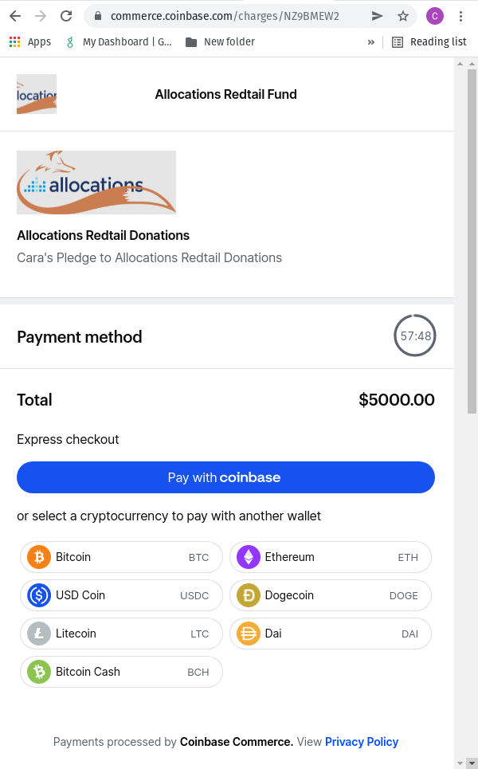

# Coinbase Cloud - Commerce Solution

Assumes existing Coinbase Commerce Account and linked Coinbase Account/Wallet.

## Create Investment/charge

**Action: User clicks "Invest with crypto"**

   - FE passes the following fields to the BE:

     1. `deal_name`
     2. `investor_name`
     3. `investment_id`
     5. `transaction_amount`
     6. `transaction_currency` (optional, not used for POC)

   - BE calls POST https://api.commerce.coinbase.com/charges

```js
curl https://api.commerce.coinbase.com/charges \
     -X POST \
     -H 'Content-Type: application/json' \
     -H "X-CC-Api-Key: <Master Seroes API Key>" \
     -H "X-CC-Version: 2018-03-22" \
     -d '{
       "name": "Atomizer XXII",
       "description": "<Cara's investment in Atomizer XXII>",
       "local_price": {
         "amount": "5000.00",
         "currency": "USD"
       },
       "pricing_type": "fixed_price",
       "metadata": {
         "investor_id": "61f1cfac547b58a39bfcfc55",
         "investor_name": "Cara Ponzini"
         "transaction_id":"61f1cfac547b58a39bfcfc58"
       },
     }'
```

these are optional but we might want to use both to redirect the investor back to the allocations dashboard after completing or cancelling the txn.

```js
'{
       "redirect_url": "https://charge/completed/page",
       "cancel_url": "https://charge/canceled/page"
}'
```

- BE receives a response containing (but not limited to):

```json
{
  "data": {
    "id": "f765421f2-1451-fafb-a513-aac6c819fba9",
    "resource": "charge",
    "code": "66BEOV2A",
    "name": "Atomizer XXII",
    "description": "Cara's investment in Atomizer XXII",
    "logo_url": "https://commerce.coinbase.com/charges/ybjknds.png",
    "hosted_url": "https://commerce.coinbase.com/charges/66BEOV2A",
    "created_at": "2017-01-31T20:49:02Z",
    "expires_at": "2017-01-31T21:49:02Z",
    "timeline": [
      {
        "time": "2017-01-31T20:49:02Z",
        "status": "NEW"
      }
    ],
    "metadata": {
      "investor_id": "61f1cfac547b58a39bfcfc55",
      "investor_name": "Cara Ponzini",
      "transaction_id": "61f1cfac547b58a39bfcfc58"
    },
    "pricing_type": "fixed_price",
    "pricing": {
      "local": { "amount": "5000.00", "currency": "USD" },
      "bitcoin": { "amount": "1.00", "currency": "BTC" },
      "ethereum": { "amount": "10.00", "currency": "ETH" }
    },
    "payments": [],
    "payment_threshold": {
      "overpayment_absolute_threshold": { "amount": "5.00", "currency": "USD" },
      "overpayment_relative_threshold": "0.05",
      "underpayment_absolute_threshold": {
        "amount": "5.00",
        "currency": "USD"
      },
      "underpayment_relative_threshold": "0.05"
    },
    "addresses": {
      "bitcoin": "mymZkiXhQNd6VWWG7VGSVdDX9bKmviti3U",
      "ethereum": "0x419f91df39951fd4e8acc8f1874b01c0c78ceba6"
    }
  }
}
```

- BE stores AT LEAST the following in DB on the Transaction record:

```json
{
  "id": "f765421f2-1451-fafb-a513-aac6c819fba9",
  "code": "66BEOV2A", // the code for the charge
  "hosted_url": "https://commerce.coinbase.com/charges/66BEOV2A"
}
```

- BE returns the following to the front end:

```JSON
{    "hosted_url": "https://commerce.coinbase.com/charges/66BEOV2A"}
```
___
## Dashboard Prompts Payment

Upon receiving charge url:
- dashboard opens charge in another tab/window 
- crypto payment button disabled for period of time for which charge is valid (to prevent generating multiple charges)

NOTES ON CHARGES: 
1. these expire after a certain period of time and we should make sure investors have sufficient time to complete.
2. with a coinbase managed commerce account, there is automatic settlement into fiat and a 1% txn fee.


___
## Charge Is Paid

When a charge is:
- confirmed (payment complete)
- failed (charge failed to complete)
- cancelled (investor cancelled the charge)
  
we'll be notified by webhook to:

`POST - /v1/crypto-transactions/webhooks`

and receive a payload similar to this
```JSON
{
    "id": 1,
    "scheduled_for": "2017-01-31T20:50:02Z",
    "event": {
        "id": "24934862-d980-46cb-9402-43c81b0cdba6",
        "resource": "event",
        "type": "charge:created",
        "api_version": "2018-03-22",
        "created_at": "2017-01-31T20:49:02Z",
        "data": {
          "code": "66BEOV2A",
          "name": "The Sovereign Individual",
          "description": "Mastering the Transition to the Information Age",
          "hosted_url": "https://commerce.coinbase.com/charges/66BEOV2A",
          "created_at": "2017-01-31T20:49:02Z",
          "expires_at": "2017-01-31T21:49:02Z",
          "timeline": [
            {
              "time": "2017-01-31T20:49:02Z",
              "status": "NEW"
            }
          ],
          "metadata": {},
          "pricing_type": "no_price",
          "payments": [],
          "addresses": {
            "bitcoin": "mymZkiXhQNd6VWWG7VGSVdDX9bKmviti3U",
            "ethereum": "0x419f91df39951fd4e8acc8f1874b01c0c78ceba6"
          }
        }
    }
}
```

- BE Will
1. Verify webhook signature from headers
   - Will be signed using our secret.
2. Update transaction status in the db
   - First find a matching transaction and make sure `coinbase_charge_code` matches `charge`
3. Ability to update other data sources possible.

